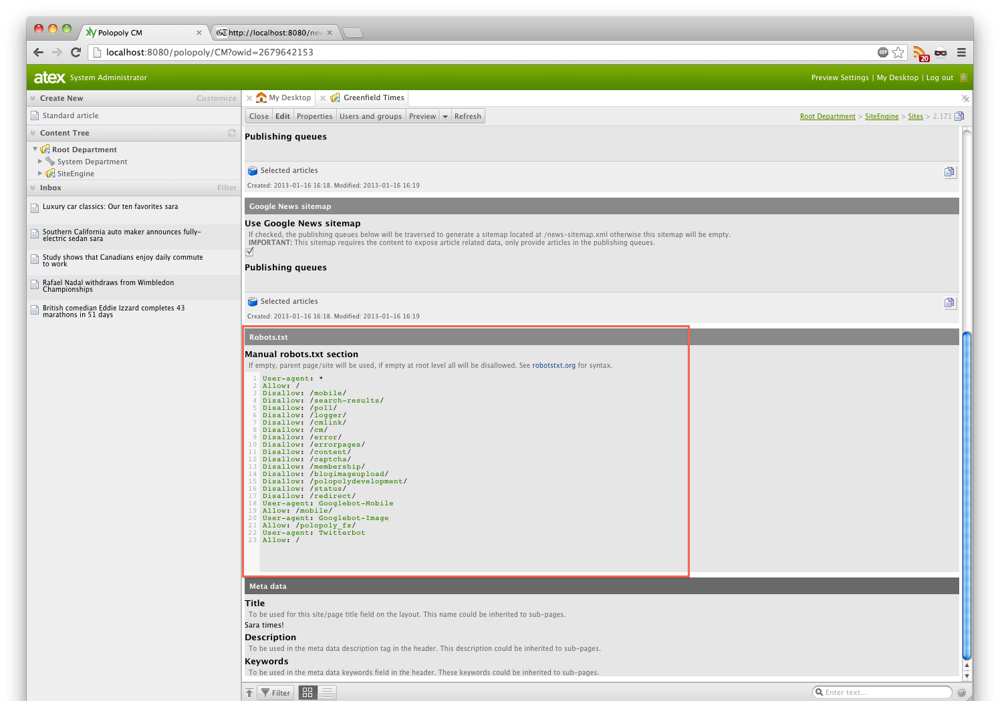

# seo-plugin
Polopoly plugin to provide basic SEO techniques (meta-data, sitemap and robots.txt) as settings on Site and Page level for a project.

## What is SEO?
SEO means Search Engine Optimization and is a very wide term to group technologies that simplifies life for search engines and the users of such.
Using the SEO plugin does NOT mean that your site automatically gets Site Engine Optimized. <u>All companies have different strategies when it comes to SEO.</u>
You need to know your requirements before you start "optimizing", the requirements are probably already known by your marketing strategist or analyst, most likely
 there's already a person working with this full time for your site.

## WARNING!
Know what you are doing. This plugin is meant to be used as a **source plugin**, meaning you will need to modify the source to work with your project and requirements (See the SEO section above).

## What comes with the package?
You will need to do some customizations to your Polopoly project to get this to work..
But this plugin comes with support for:

1. Regular sitemap located at /sitemap.xml
2. Google News sitemap located at /news-sitemap.xml
3. Robots.txt located at /robots.txt
4. Meta data for the header of your layout

## Installing
This is a Polopoly plugin, once you've followed [the regular source plugin installation guide](http://support.polopoly.com/confluence/display/PolopolyMaster/How+to+use+plugins) you will have the required Java and template code. But wait, you're not done yet...

All the features in the plugin will require their own settings section in your site's (or page's) input template. Polopoly does not yet provide these templates in an easy-to-override fashion but you might already have it in your project.
Try searching for *p.siteengine.Site* in your templates to see if you find a template definition.

It's optional to add these settings on page level, if for example you would like a different robots.txt per page. <u>Note that pages and sites are NOT the same in Polopoly.</u> Pages are sometimes called sub-sites, but they do not share template with real sites.
Try searching for *p.siteengine.Page* in your templates to see if you find a template definition. To see what template your page/sub-site/site/content is using, checkout Properties -> Inspector and look for "Input template id".

Once you have found your template(s) in your project you can follow the steps below.
### 1. Regular and Google News sitemap
Adding the sitemap configuration section to your site is only about adding one line of xml to your site template (p.siteengine.Site), however, you might want to wrap it in some layout in order for it to be easy to find. For this example I created an extra tab on the site called "SEO", 
but it might be even prettier if you wrap each of these SEO techniques in their own sub-tab.

    ...
    <layout name="seoConfiguration" input-template="p.Page" label="SEO">
      <field name="sitemapConfig" input-template="com.atex.plugins.seoplugin.SitemapConfigField" label="" />
    </layout>
    ...
    
*Since we don't want to override the site policy, the Java code makes some assumptions on the location of this field. It's important it's on the site template and that the name of the field is <b>sitemapConfig</b> .*

In order for the sitemaps to be available on /sitemap.xml you need to modify your web.xml and add the sitemap filter that comes with the plugin. The filter definition is available in a file called *web-fragment.xml* but you can also take it from here.

    ...
    <!-- Filter definition for sitemap -->
    <filter>
      <filter-name>sitemapFilter</filter-name>
      <filter-class>com.atex.plugins.seoplugin.filter.SitemapFilter</filter-class>
    </filter>
    ...

You also need to add the filter mapping. It's **important** that the mapping is placed after the *charencodingfilter* but before the *modefilter*.

    ...
    <!-- Mapping of the sitemap filter -->
    <filter-mapping>
      <filter-name>sitemapFilter</filter-name>
      <url-pattern>*.xml</url-pattern>
      <dispatcher>REQUEST</dispatcher>
    </filter-mapping>
    ...
    
We map against all URLs that ends with .xml and determines if we should show a sitemap or not in the filter. The reason for this is to support both the regular sitemap and the Google News sitemap, which can be changed in the filter 
but is located at /news-sitemap.xml by default.

**Note:** For an article to expose all fields available for the Google News sitemap, implement the GoogleNewsSitemapModelTypeDescription on your article policy.

### 2. Robots.txt
To add the Robots.txt configuration section to your site, you need to add that as well to your template, having both sitemaps and this in the same tab would mean having this in your template:

    ...
    <layout name="seoConfiguration" input-template="p.Page" label="SEO">
      <field name="sitemapConfig" input-template="com.atex.plugins.seoplugin.SitemapConfigField" label="" />
      <field name="robotsConfig" input-template="com.atex.plugins.seoplugin.RobotsConfigField" label="" />
    </layout>
    ...
    
*Since we don't want to override the site policy, the Java code makes some assumptions on the location of this field. It's important it's on the site template and that the name of the field is <b>robotsConfig</b> .*

In order to get the Robots.txt file available at /robots.txt you need to modify your web.xml and add the robots.txt filter definition. The filter definition is available in a file called *web-fragment.xml* but you can also take it from here.

    ...
    <!-- Filter definition for robots.txt -->
    <filter>
      <filter-name>robotsFilter</filter-name>
      <filter-class>com.atex.plugins.seoplugin.filter.RobotsTxtFilter</filter-class>
    </filter>
    ...

You also need to add the filter mapping. It's **important** that the mapping is placed after the *charencodingfilter* but before the *modefilter*.

    ...
    <!-- Mapping of the robots filter -->
    <filter-mapping>
      <filter-name>robotsFilter</filter-name>
      <url-pattern>*.txt</url-pattern>
      <dispatcher>REQUEST</dispatcher>
    </filter-mapping>
    ...

We map against all URLs that ends with *.txt and make a check in the filter if we are to deliver the robots.txt file.

**Note:** The robots.txt feature allows for inheritance, if you add the same configuration to the page template, fill it in and browse the page's URL appending /robots.txt you'll get the one for the page. If nothing is added, the parent page or site 
configuration will be used instead. The inheritance will check all parent pages until it reaches a site. If no configuration found **all will be disallowed**.

### 3. Meta data
To add the Meta data configuration section to the site, you need to add that as well to your site template, having both sitemaps, robots.txt and this in the same tab would mean having this in your template:

    ...
    <layout name="seoConfiguration" input-template="p.Page" label="SEO">
      <field name="sitemapConfig" input-template="com.atex.plugins.seoplugin.SitemapConfigField" label="" />
      <field name="robotsConfig" input-template="com.atex.plugins.seoplugin.RobotsConfigField" label="" />
      <field name="metadataConfig" input-template="com.atex.plugins.seoplugin.MetaDataConfigField" label="" />
    </layout>
    ...

*Since we don't want to override the site policy, the Java code makes some assumptions on the location of this field. It's important it's on the site template and that the name of the field is <b>metadataConfig</b> .*

Once you have the configuration you need to add the output of this to your pagelayout.vm file, in Greenfield Times, this would be defaultpagelayout.vm.
Replace your current meta data (title, description, keywords) with:

    #set($metaDataContent = $content)
    #if($m.context.page.pathAfterPage.size() > 0)
        #set($metaDataContent = $m.context.page.pathAfterPage.get(0))
    #end
    #renderwithfallback({"content": $metaDataContent, "outputTemplate":"com.atex.plugins.seoplugin.MetaData.ot", "":""})
        ##Something went wrong, you could add a static title, description and/or keywords here
    #end

*This could possibly be done with a one-liner as a future improvement.*

**Note:** The meta data feature allows for inheritance, if you add the same configuration to the page template, fill it in and browse the page's URL you'll get the meta data for the page. If nothing is added, the parent page or site 
configuration will be used instead. The inheritance will check all parent pages until it reaches a site. If no configuration found the site name will be used for title as a last fall back. **You most likely want to add this setting to the
page, otherwise it will only use the site's meta data on pages.**

An article page (or any content implementing the **MetaDataModelTypeDescription** interface) will expose it's own meta data. This can be manipulated in the MetaDataController to for example, like it does currently, add publish date to the page title.

## User Guide
The location of these settings might vary pending on where you place them in the site/page templates.

### 1. Regular and Google News sitemap
The regular sitemap comes with two flavors.
* The manual, which is just a plain text area that can take anything, if for example, you want your sitemap to contain URLs not hosted within Polopoly.
* Publishing queues, which are just lists of anything. These lists will be traversed to generate the URLs to the content within.

These flavors can be enabled and disabled asynchronously using check boxes, if for example you want to quickly disable the manual section without removing the content.

The above setup results in the following output.

The Google News sitemap is only meant to support articles and works in the same fashion as the Publishing queue flavor of the regular sitemap. The article policy (policies) should implement the GoogleNewsSitemapModelTypeDescription interface to properly 
expose the required data in the sitemap. The publishing queue could for example be search driven to provide your sites latest articles.

The Google News sitemap output can quickly be disabled using the checkbox. If disabled the sitemap will appear empty.

The above setup results in the following output.

### 2. Robots.txt
The purpose of the Robots.txt is mostly to tell search engine crawlers what locations of your site that should be ignored. For example you probably don't want your search result or mobile pages to appear in Google searches.
This setting usually don't change very often and you usually want to allow crawlers everywhere with some exceptions. That's why it's currently just a simple text area.

**Note:** If you leave this field empty the Robots.txt page will disallow crawlers on all pages.

The above setup results in the following output.

**Note:** The Robots.txt field can be inherited and overridden by sub pages, if the field is empty for that sub page, it will look for the setting on the parent page/site.

The following could be a good default (on your site) pending on your project, for example 'search-results' should be the path to your search result page.

    User-agent: *
    Allow: /
    Disallow: /mobile/
    Disallow: /search-results/
    Disallow: /poll/
    Disallow: /logger/
    Disallow: /cmlink/
    Disallow: /cm/
    Disallow: /error/
    Disallow: /errorpages/
    Disallow: /content/
    Disallow: /captcha/
    Disallow: /membership/
    Disallow: /blogimageupload/
    Disallow: /polopolydevelopment/
    Disallow: /status/
    Disallow: /redirect/
    User-agent: Googlebot-Mobile
    Allow: /mobile/
    User-agent: Googlebot-Image
    Allow: /polopoly_fs/
    User-agent: Twitterbot
    Allow: /

### 3. Meta data
This feature simply allows for 3 fields to use inheritance to expose meta data in your layout.

For example, the page name in Polopoly is not always what you want to use in the title of your page. In stead of 'Greenfield Times' you might want to have 'Greenfield Times - Bringing you yesterdays news today!', this field allows for that and for your sub pages to 
inherit or override them.

**Note:** If there's no data present in these fields and you've added the output of this feature to your page layout, you will only get the name of the page/site as a title. Also, your article policy/policies should implement the *MetaDataModelTypeDescription* interface to 
expose themselves for meta data extraction. 

## References
* [Regular sitemaps](http://www.sitemaps.org/)
* [Google News sitemaps](http://support.google.com/webmasters/bin/answer.py?hl=en&answer=75717&topic=10078&ctx=topic)
* [Robots.txt](http://www.robotstxt.org/)

TODO's
======
* <del>Need to add better documentation ;)</del>
* <del>Need to add usage instructions with screenshots</del>
* <del>Need to add language keys for meta-data</del>
* Some tests would be nice
* Move some classes for better structure
* Make the meta data inclusion to a one liner